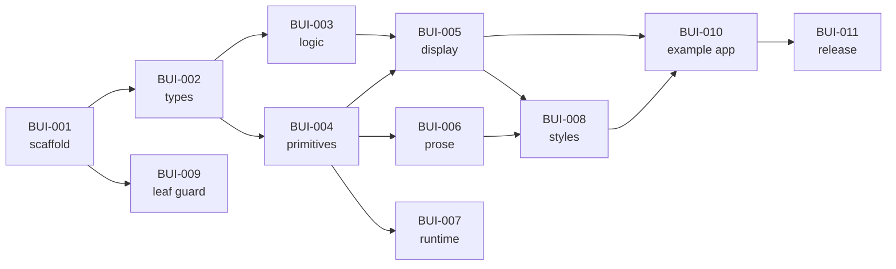

# EPIC: Build & ship `bloomwright-ui`

> **v0.2 amendment — render core (authoritative).** bloomwright-ui absorbed the ECharts and
> Mermaid **rendering** workflows and the cache/addressing port from bloomwright-mdx. New work
> beyond the v0.1 UI kit:
> - **BUI-012 — ECharts render core:** `bloomwright-ui/echarts` (SSR-to-SVG engine, fence
>   parse/compile, markup, artifact store) + `components/render/EChart.astro` + `echart-shell`.
> - **BUI-013 — Mermaid render core + injected render port:** `bloomwright-ui/mermaid` (batch
>   pipeline, transform/theme/palette, build-context bridge) + `bloomwright-ui/cache`
>   (`DiagramCacheStore` + `createDiskCacheStore`) + `components/render/MermaidDiagram*.astro`
>   + `mermaid-diagram-shell`. The pipeline calls a **caller-injected `MermaidRenderPipeline`**;
>   the shipped `fixtureRenderPipeline` is the only renderer the package invokes itself.
> - **Guard relaxed:** `guard:leaf` now allows rendering libraries but still forbids
>   host/`bloomwright-mdx` imports **and** ambient env reads. `echarts` added as a peer dep.
> - **101 unit tests** (incl. an injected-render-pipeline test); the byte-for-byte DaisyUI
>   parity test is unchanged. The v0.1 BUI tickets below remain done.
>
> Goal (v0.1): extract the DaisyUI-based UI kit into a standalone, reusable Astro package that
> both applications and `bloomwright-mdx` can consume. Every ticket below is **independently
> testable** — each states its own acceptance criteria (AC) and how to verify.
>
> Source of truth for scope: [`SPEC.md`](./SPEC.md).

**Legend:** `AC` = acceptance criteria (must be demonstrable/automatable). Effort: S/M/L.
Status: ☐ todo.

---

## ✅ BUI-001 — Repo scaffold & tooling  · S
**Goal:** a green, installable baseline.
**Scope:** `package.json`, `tsconfig.json`, `vitest.config.ts`, `.gitignore`, `.npmrc`,
`eslint.config.mjs`, `LICENSE`, baseline smoke test. (Most already scaffolded.)
**AC**
1. `npm install` completes with no errors.
2. `npm run typecheck` passes.
3. `npm test` runs `tests/unit/smoke.test.ts` and passes.
4. `exports` map resolves: importing `bloomwright-ui`, `bloomwright-ui/styles.css`, and
   `bloomwright-ui/daisyui-preset.css` succeeds in a scratch script.

## ✅ BUI-002 — Shared type contracts  · S
**Goal:** own `Icon`/`Button` types.
**Scope:** `src/types/icon.ts`, `src/types/button.ts`, barrel re-exports.
**Depends:** BUI-001.
**AC**
1. `Icon`, `RibbonIcon`, `ButtonVariant`, `ButtonSize` are exported from `bloomwright-ui`.
2. `ButtonVariant`/`ButtonSize` members reconciled against the source project's
   `src/types/button.ts` (documented in the PR).
3. `tsc --noEmit` passes; a type-only import test compiles.

## ✅ BUI-003 — Port pure domain logic (resolvers)  · M
**Goal:** the framework-free source of truth shared with `bloomwright-mdx`.
**Scope:** `src/logic/{callout,chat,list,steps,section-header}.ts`; port the existing Vitest
suites (`callout`, `chat`, `list`, `steps`, + add `section-header`).
**Depends:** BUI-002.
**AC**
1. All five resolvers implement FR-L1…FR-L5 and import only `../types/*`.
2. Ported unit suites pass (`npm test`), including the existing negative-path cases
   (invalid variant, empty title, out-of-range `currentStep`, empty list).
3. `guard:leaf` passes for `src/logic/**`.
4. Barrel re-exports each resolver module (uncomment in `src/index.ts`).

## ✅ BUI-004 — Primitive components  · M
**Goal:** `SVGIcon`, `Button`, `GlassPanel`, `OverlayPanel`.
**Scope:** `src/components/primitive/*.astro`; `src/styles/primitive/_panel.css`.
**Depends:** BUI-002.
**AC**
1. `SVGIcon` renders an `Icon` (viewBox/content/stroke props) to inline `<svg>`.
2. `Button` renders correct DaisyUI classes for each `ButtonVariant`×`ButtonSize`.
3. `OverlayPanel` emits a `popover`/dialog structure with correct ARIA and a toggle target.
4. All four render without error in the example app (BUI-010) and import only `../../types/*`
   and sibling primitives.

## ✅ BUI-005 — Display components  · L
**Goal:** `Callout`, `ChatBubble`, `List`, `Steps`, `MockupBrowser`, `MockupPhone`,
`MockupWindow`, `SectionHeader`.
**Scope:** `src/components/display/*.astro`; `src/styles/display/*.css`.
**Depends:** BUI-003, BUI-004.
**AC**
1. Each component consumes its FR-L resolver (no duplicated variant logic).
2. Rendered markup matches the reference HTML captured from the source project (snapshot per
   component) — this is the parity contract `bloomwright-mdx` depends on.
3. `<Callout>` uses `<SVGIcon>` and applies `not-prose`.
4. Components render in the example app across `light`/`dark` themes.

## ✅ BUI-006 — Prose / MDX surface components  · M
**Goal:** `CodeBlock`, `ProseTable`, `HeadingAnchor`, `VideoPlayer`.
**Scope:** `src/components/prose/*.astro`; `src/styles/mdx/*.css`.
**Depends:** BUI-004.
**AC**
1. `HeadingAnchor` accepts an optional `icon?: Icon` prop with a working inline default and
   does **not** import icon data (FR-C4). Verified by `guard:leaf`.
2. `CodeBlock` renders a `<pre>`-replacement with copy affordance; `ProseTable` wraps tables
   responsively; `VideoPlayer` pairs with `video-player-shell`.
3. All render in the example app.

## ✅ BUI-007 — Client runtime web components  · M
**Goal:** `overlay-panel`, `video-player-shell`.
**Scope:** `src/runtime/*.ts`.
**Depends:** BUI-004.
**AC**
1. Importing each module defines its custom element exactly once (idempotent guard);
   re-import does not throw.
2. `overlay-panel` opens/closes the paired `OverlayPanel` and restores focus/scroll;
   `disconnectedCallback` removes listeners/observers.
3. Modules reference only DOM APIs (`guard:leaf` passes; no bloomwright-mdx import).
4. Manual/e2e check in the example app: toggling the overlay works with keyboard + click.

## ✅ BUI-008 — Styles bundle & DaisyUI preset  · M
**Goal:** shippable, themable CSS.
**Scope:** finalize `src/styles/index.css` (uncomment ported partials),
`src/styles/daisyui-preset.css`, `src/styles/shared/_daisyui-overrides.css`.
**Depends:** BUI-005, BUI-006.
**AC**
1. `styles.css` imports every shipped component partial; no dangling `@import`.
2. `daisyui-preset.css` `include` list covers exactly the DaisyUI parts used (audited).
3. In the example app, all components are correctly styled using only DaisyUI semantic
   classes + these partials (no brand colors baked into bloomwright-ui).

## ✅ BUI-009 — Leaf-invariant CI guard  · S
**Goal:** prevent host coupling from creeping back.
**Scope:** `scripts/check-leaf-invariant.mjs` (scaffolded) + CI wiring.
**Depends:** BUI-001.
**AC**
1. `npm run guard:leaf` exits 0 on a clean tree and non-zero when a forbidden import is
   introduced (add a temporary offending line to prove it fails, then revert).
2. Guard runs in CI on every PR.

## ✅ BUI-010 — Public API + example app smoke  · M
**Goal:** prove end-to-end consumption.
**Scope:** `examples/` (dev-only, unpublished) Astro app importing every component + styles;
finalize barrel exports.
**Depends:** BUI-005, BUI-008.
**AC**
1. The example app builds (`astro build`) and `astro check` passes.
2. It renders at least one instance of every display/primitive/prose component with a theme
   defined by the app (not bloomwright-ui).
3. `bloomwright-mdx` (linked) compiles against `bloomwright-ui/logic/*` and `Icon` with no type errors.

## ◑ BUI-011 — Release & distribution  · S
**Goal:** publishable package.
**Scope:** Changesets (or manual version policy), `.npmrc`/registry config, publish workflow,
`files` allow-list audit.
**Depends:** BUI-010.
**Status:** `files` allow-list **audited & verified** (AC1 done — `npm pack` ships only
`src/**` + `README.md` + `LICENSE` + `package.json`; `tests/`, `examples/`, `scripts/`, and
configs excluded). AC2/AC3 (registry dry-run + external install) are deferred: the owner is
not publishing to a public registry for now. `npm link` / `file:` consumption is proven by
the `examples/` app instead.
**AC**
1. ✅ `npm pack` produces a tarball containing `src/**`, `README.md`, `LICENSE` and
   **excluding** `tests/`, `examples/`, `scripts/`.
2. ⏳ A dry-run publish to the chosen registry succeeds. *(deferred — not publishing)*
3. ⏳ Tag `v0.1.0`; a scratch external Astro app installs it from the registry and renders a
   `<Callout>`. *(deferred — proven locally via `examples/` + `file:` link)*

---

### Done = the whole epic
`bloomwright-ui` installs cleanly in a blank Astro app, renders every component under the app's own
theme, ships no host coupling (`guard:leaf` green), and `bloomwright-mdx` builds against its logic
+ types. All ported unit suites pass.
