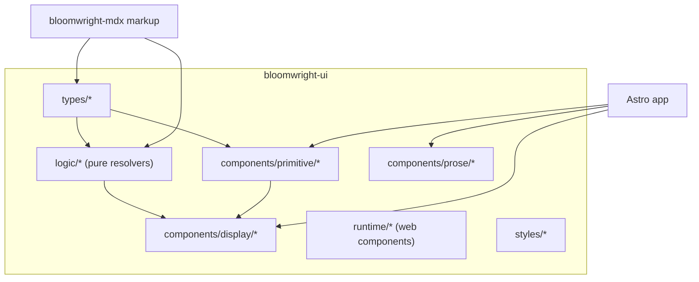

# bloomwright-ui — Specification & Design Document

> Spec-driven design. This document is the authoritative contract for `bloomwright-ui`.
> Implementation is tracked in [`EPIC.md`](./EPIC.md); every functional requirement below
> is traceable to one or more tickets (§11).

- **Status:** v2 (implemented) — **render core**: absorbs the ECharts/Mermaid rendering
  workflows and the cache port. Supersedes v1 "dependency-free leaf" framing where it conflicts.
- **Owner:** Alberto Duran
- **Consumers:** Astro applications; [`bloomwright-mdx`](../bloomwright-mdx)

---

## 0. Amendment — render core (v2, authoritative)

> **v2.1 (mermaid-execution ownership).** bloomwright-ui now ships the **`mermaidRenderer()`**
> Astro integration (`bloomwright-ui/mermaid-renderer`) that owns Mermaid SVG creation end to
> end: it pre-scans sources (fences + `defineMermaidDiagram()`), batch-renders through the
> caller's injected pipeline, caches, emits `_app/mermaid/*.svg`, and seeds the render bridge.
> `bloomwright-mdx` only emits `<MermaidDiagram code>`; this package renders it. Both
> fence-generated and hand-written `<MermaidDiagram>` resolve through one component + one bridge.
> `renderMermaidFenceHtml` serves the `.md` path. Discovery (`collect`, `source-parser`) and the
> `content-selection` seam now live here; `fast-glob` + `typescript` are dependencies.

This section **supersedes any conflicting v1 text below** (notably G5 "remain a leaf" and the
"presentation-only / no application logic" framing).

- **bloomwright-ui is the render core.** In addition to the DaisyUI kit, it now owns the
  ECharts SSR-to-SVG engine (`bloomwright-ui/echarts`), the Mermaid render pipeline
  (`bloomwright-ui/mermaid`), the cache & addressing port (`bloomwright-ui/cache`), and the
  render components (`bloomwright-ui/components/render/{EChart,MermaidDiagram,
  MermaidDiagramWrapper}.astro`). `bloomwright-mdx` extracts fence/definition setup and drives
  these workflows.
- **Not a dependency-free leaf.** It now depends on `echarts` (peer) and `hast-util-*`,
  `unist-util-visit`, `postcss` (deps), plus `astro` (peer). The invariant is relaxed to: no
  host-app imports, no `bloomwright-mdx` import (would be a cycle), and **no ambient env reads**
  (`process.env`/`loadEnv`) — enforced by `guard:leaf`.
- **Caller-owned Mermaid render port (SPEC §…).** Production SVGs come from an injected
  `MermaidRenderPipeline` (`(diagrams, themes) => Promise<RenderResult>`). bloomwright-ui ships
  and invokes only `fixtureRenderPipeline` (dev/tests); the pipeline `renderChunk` calls the
  injected `render`, so credentials/endpoints live entirely in the caller's function.
- **Options-first.** Themes, batching, cache backend, and the render pipeline are all injected;
  the package reads no environment.

---

## 1. Purpose

Provide a reusable **DaisyUI + Astro** component kit **and render core** that can be dropped
into any Astro project and reused as the visual "source of truth" and rendering engine by
`bloomwright-mdx`. The kit renders against DaisyUI semantic classes and adopts the consumer's
theme; the render core turns chart options and diagram definitions into static SVG at build
time via injected pipelines.

## 2. Goals & non-goals

### Goals
- G1. Ship display, primitive, and prose components as source `.astro` files.
- G2. Expose the **pure domain logic** (variant/validation resolvers) as framework-free
  TypeScript that `bloomwright-mdx` can import to guarantee identical output.
- G3. Ship progressive-enhancement **client web components** with no framework runtime.
- G4. Ship component **CSS** + a DaisyUI **include preset**, themable by the consumer.
- G5. Remain a **leaf**: zero dependency on any app or on `bloomwright-mdx`.

### Non-goals
- N1. No brand/content components (site logo, social links, skills ribbon) — those stay in
  the consuming app.
- N2. No icon **data** — components accept icons as props.
- N3. No theme tokens / brand colors — the consumer owns those.
- N4. No build-time rendering, diagram/chart pipelines, or code-fence parsing — that is
  `bloomwright-mdx`.
- N5. No React/Vue/Svelte wrappers in v1.

## 3. Personas & use cases

- **App author** imports `<Callout>`, `<Steps>`, `<MockupWindow>` into `.astro`/`.mdx`,
  loads `styles.css`, and gets themed components.
- **bloomwright-mdx maintainer** imports `resolveCallout`, `resolveStepItems`, etc. so the
  ` ```daisyui ` fence renderer emits markup identical to `<Callout>`/`<Steps>`.
- **Design-system consumer** overrides look via DaisyUI theme tokens without forking.

## 4. Functional requirements

### 4.1 Types (FR-T)
- **FR-T1.** Export `Icon`, `RibbonIcon` (inline-SVG descriptor) and `ButtonVariant`,
  `ButtonSize` from the package barrel. `Icon` is the canonical contract reused by
  `bloomwright-mdx`.

### 4.2 Domain logic (FR-L) — pure, framework-free, the source of truth
- **FR-L1. Callout:** `CALLOUT_VARIANTS`, `resolveCallout(variant, title?, icon?, palette?)`,
  `calloutPaletteStyle()`. Validates variant, non-empty title, palette CSS values.
- **FR-L2. Chat:** `CHAT_BUBBLE_COLOR_CLASSES`, `chatBubbleColorClass(color?)`.
- **FR-L3. List:** item/status/action/media types + `resolveListItems()` with per-field
  validation and `listStatusColorClass`, `listActionAttributes`.
- **FR-L4. Steps:** `STEP_COLOR_CLASSES`, `resolveStepItems(items, currentStep?, activeColor)`
  with range validation of `currentStep`.
- **FR-L5. Section header:** `resolveSectionHeader({ title, id?, level?, link? })` →
  heading tag + optional CTA link attributes.
- **FR-L6.** Every resolver is deterministic, throws typed errors on invalid input, and has
  **no** Astro/DOM/Node imports.

### 4.3 Components (FR-C)
- **FR-C1. Display:** `Callout`, `ChatBubble`, `List`, `Steps`, `MockupBrowser`,
  `MockupPhone`, `MockupWindow`, `SectionHeader` — each consumes its FR-L resolver and
  renders DaisyUI markup with `not-prose` isolation.
- **FR-C2. Primitive:** `SVGIcon` (renders an `Icon`), `Button` (variant/size, optional
  icon), `GlassPanel`, `OverlayPanel` (popover/dialog shell paired with the `overlay-panel`
  runtime element).
- **FR-C3. Prose surfaces:** `CodeBlock`, `ProseTable`, `HeadingAnchor`, `VideoPlayer` —
  generic MDX prose replacements with **no build coupling**.
- **FR-C4.** `HeadingAnchor` accepts its anchor icon as an **optional prop** with a built-in
  inline default (no `@data/icons` import).

### 4.4 Client runtime (FR-R)
- **FR-R1.** `overlay-panel` and `video-player-shell` register as custom elements
  (idempotent `customElements.define` guard), enhance server-rendered markup, and clean up
  on `disconnectedCallback`.
- **FR-R2.** Runtime modules are import-side-effecting, tree-shakeable, and depend only on
  DOM APIs.

### 4.5 Styles (FR-S)
- **FR-S1.** `styles.css` aggregates component CSS partials via `@import`.
- **FR-S2.** `daisyui-preset.css` documents the required DaisyUI `include` list.
- **FR-S3.** All rules use DaisyUI semantic classes / CSS variables; no hard-coded brand
  colors.

## 5. Non-functional requirements & boundary rules

- **NFR1 — Leaf invariant.** No source file may import `@data/*`, `@utils/*`, `@content/*`,
  `@integrations/*`, `@appTypes/*`, `@components/*`, `@layouts/*`, `@runtime/*`, or
  `bloomwright-mdx`. Enforced by `scripts/check-leaf-invariant.mjs` in CI (FR maps to BUI-009).
- **NFR2 — Peer deps only.** `astro`, `tailwindcss`, `daisyui` are peers; no runtime deps.
- **NFR3 — Source-shipped.** `.astro`/`.ts` compiled by the consumer's Astro/Vite; no
  bundling of components required.
- **NFR4 — Deterministic logic.** FR-L resolvers are unit-testable without a DOM.
- **NFR5 — Accessibility.** Interactive components expose correct ARIA roles/labels
  (dialog/popover, step `aria-current`, list link labels).
- **NFR6 — Node ≥ 22.13.

## 6. Architecture



The **logic layer is the seam** with `bloomwright-mdx`: components render it as `.astro`;
`bloomwright-mdx` renders it as HTML strings. Keeping one implementation guarantees parity.

## 7. Public API (contract)

```jsonc
// exports map
{
  ".":               "./src/index.ts",          // types + logic barrel
  "./components/*":   "./src/components/*",       // e.g. bloomwright-ui/components/display/Callout.astro
  "./logic/*":        "./src/logic/*.ts",         // e.g. bloomwright-ui/logic/callout
  "./runtime/*":      "./src/runtime/*.ts",
  "./styles.css":     "./src/styles/index.css",
  "./daisyui-preset.css": "./src/styles/daisyui-preset.css"
}
```

Barrel (`.`) exports: `Icon`, `RibbonIcon`, `ButtonVariant`, `ButtonSize`, and all FR-L
resolvers/consts/types. Anything not in the `exports` map is private.

## 8. Distribution

- Publish to **GitHub Packages** (scoped) or public npm, versioned with semver.
- Consumers install `bloomwright-ui` and the three peers.
- During co-development with `bloomwright-mdx`, use `npm link` (README) so changes are immediate
  without republishing.
- Recommended: automate versioning/changelog with Changesets (BUI-011).

## 9. Testing strategy

- **Unit (Vitest):** FR-L resolvers (callout/chat/list/steps/section-header) — ported from
  the source project's existing suites; must stay green with no Astro runtime.
- **Component smoke:** a dev-only `examples/` Astro app renders every component; `astro check`
  must pass. (Not published.)
- **Guard:** `guard:leaf` runs in CI (NFR1).
- **Definition of done for a component:** resolver unit test green + renders in example app +
  markup matches the reference captured from the source project.

## 10. Risks & mitigations

- **R1. Markup drift between `<Callout>` and bloomwright-mdx's fence output.** → Single shared
  resolver (FR-L) + a cross-package snapshot test in bloomwright-mdx (BMX-003).
- **R2. Tailwind v4 not scanning package classes.** → Document `@source` (FR-S2) and verify
  in the example app (BUI-010).
- **R3. Button union mismatch vs. source project.** → Reconcile during BUI-002.

## 11. Traceability (requirements → tickets)

| Requirement | Ticket(s) |
|-------------|-----------|
| Scaffold, tooling, CI | BUI-001 |
| FR-T1 | BUI-002 |
| FR-L1…L6 | BUI-003 |
| FR-C2 (primitives) | BUI-004 |
| FR-C1 (display) | BUI-005 |
| FR-C3, FR-C4 (prose) | BUI-006 |
| FR-R1, FR-R2 (runtime) | BUI-007 |
| FR-S1…S3 (styles) | BUI-008 |
| NFR1 (leaf guard) | BUI-009 |
| Public API + example app | BUI-010 |
| Distribution/release | BUI-011 |
